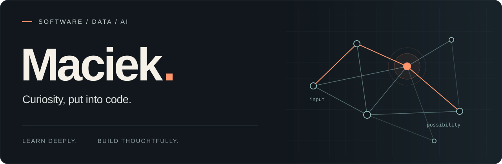

  

  <strong>Computer Science graduate · Master's student at WAT · Focused on AI</strong>

  <a href="https://www.linkedin.com/in/maciej-klimiuk-bb74282b5/">LinkedIn ↗</a>
  &nbsp;&nbsp;·&nbsp;&nbsp;
  <a href="#about">About</a>
  &nbsp;&nbsp;·&nbsp;&nbsp;
  <a href="#toolkit">Toolkit</a>
  &nbsp;&nbsp;·&nbsp;&nbsp;
  <a href="#beyond-the-keyboard">Beyond the keyboard</a>

 

## About

Hey, I'm **Maciek** — a Computer Science engineering graduate, now pursuing a **master's degree at WAT** (Military University of Technology) in Warsaw.

**AI is my main focus.** I'm especially interested in machine learning, natural language processing, and turning data into something useful. I like understanding how things work, then putting that knowledge into practice through code.

### What I'm exploring

| Area | What draws me in |
| :--- | :--- |
| **Artificial intelligence** | Understanding models and finding practical ways to use them. |
| **Data science** | Exploring data, testing ideas, and making sense of the results. |
| **Natural language processing** | How models work with language and what we can build with them. |

 

## Toolkit

**Languages**  
`Python` &nbsp; `SQL` &nbsp; `C++` &nbsp; `Java` &nbsp; `C`

**Development & analysis**  
`Git` &nbsp; `Jupyter Notebook` &nbsp; `JetBrains IDEs`

**Databases**  
`MySQL`

 

## Beyond the keyboard

Triathlon, calisthenics, car detailing, and 3D printing.

Different ways to keep moving, make things, and pay attention to the details.

 

---

  <strong>Have an interesting idea? Let's talk.</strong> 
  Open to conversations about AI, learning, and collaboration.  
  <a href="https://www.linkedin.com/in/maciej-klimiuk-bb74282b5/">Connect on LinkedIn ↗</a>

